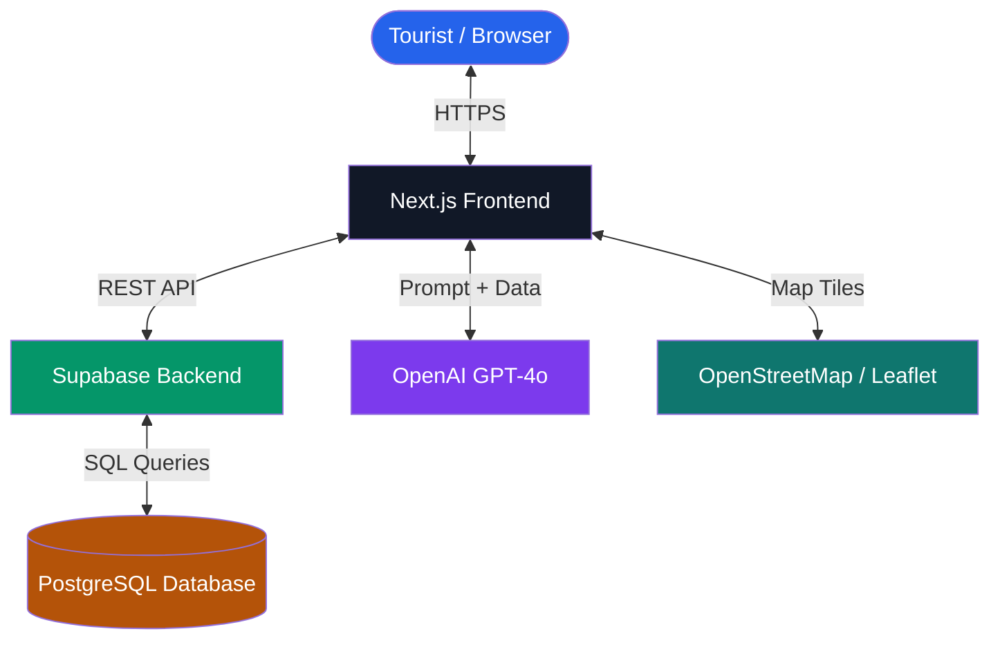

<div align="center">

# 🥾 Paaila (पाइला)
### *Your First Step Into Nepal*

**Nepal's AI-powered tourism companion — discover destinations, plan trips, and travel smarter.**

*Built with ❤️ by **Team Pahilo** for the Government Tourism Hackathon 2026 🇳🇵*

---

[]()
[]()
[]()
[]()

---

<p align="center">
  <a href="#-the-problem">Problem</a> •
  <a href="#-our-solution">Solution</a> •
  <a href="#-features">Features</a> •
  <a href="#-tech-stack">Tech Stack</a> •
  <a href="#-architecture">Architecture</a> •
  <a href="#-getting-started">Getting Started</a> •
  <a href="#-team">Team</a>
</p>

</div>

---

## 🧭 What is Paaila?

**Paaila** (पाइला) means *"step"* or *"footprint"* in Nepali — because every great journey begins with a single step.

Paaila is a smart tourism platform built for Nepal. It helps both domestic and international tourists discover destinations, plan personalized itineraries, find nearby hotels and restaurants, explore local food, and access emergency contacts — all from one place.

No more jumping between Google Maps, travel blogs, booking sites, and WhatsApp groups. Paaila brings everything together.

---

## ❓ The Problem

Tourists visiting Nepal face a fragmented experience:

| Pain Point | Current Workaround |
|---|---|
| Finding destinations | Generic Google Maps pins |
| Cultural & historical context | Scattered travel blogs |
| Hotel & restaurant discovery | Separate booking apps |
| Local food recommendations | Social media guesswork |
| Emergency contacts | Searching in a panic |
| Trip planning | Manual spreadsheets |

This wastes time, causes missed experiences, and leaves Nepal's rich cultural wealth largely undiscovered — especially for first-time visitors.

---

## 💡 Our Solution

Paaila consolidates the entire travel experience into one intelligent platform.

> 🗺️ **Discover** — Interactive map with 20+ curated destinations across Nepal
>
> 🤖 **Plan** — AI-generated itineraries personalized to your budget, interests, and duration
>
> 🏨 **Stay & Eat** — Verified hotels and restaurants linked directly to each destination
>
> 🍜 **Taste** — Local food guide with authentic dishes from every region
>
> 🚨 **Stay Safe** — Emergency contacts for police, hospitals, and tourist helplines

---

## ✨ Features

### 🗺️ Interactive Map
Browse all tourist destinations on a live map. Click any pin to see the full destination details — history, entry fee, opening hours, and nearby amenities.

### 🔍 Destination Explorer
Filter destinations by category (Heritage, Religious, Nature, Adventure) and province. Each destination page includes rich cultural context, best season to visit, and travel tips.

### 🤖 AI Trip Planner
Tell Paaila your budget, number of days, and interests. The AI generates a complete day-by-day itinerary using only real, verified destinations from our database.

**Example:**
```
Input:  3 days · Cultural · Mid-range budget
Output: Day 1 → Pashupatinath + Boudhanath + Thamel House Restaurant
        Day 2 → Patan Durbar Square + Newa Lahana (Newari cuisine)
        Day 3 → Bhaktapur + Nagarkot sunset
```

### 🏨 Nearby Hotels & Restaurants
Every destination is linked to nearby hotels (filtered by budget) and restaurants (with local specialty dishes highlighted).

### 🍜 Local Food Guide
Discover authentic Nepali dishes — Momo, Dal Bhat, Samay Baji, Yomari, Juju Dhau, and more — with origin stories and where to find them.

### 🚨 Emergency Page
Instant access to 22 emergency contacts including Tourist Police (1144), NTB Helpline (1179), hospitals, ambulance, and embassy numbers.

---

## 🛠️ Tech Stack

| Layer | Technology |
|---|---|
| **Frontend** | Next.js 15, TypeScript, Tailwind CSS, shadcn/ui |
| **Map** | Leaflet + React Leaflet, OpenStreetMap |
| **Backend** | Supabase (PostgreSQL + Auth + RLS) |
| **AI** | OpenAI API (GPT-4o) |
| **Hosting** | Vercel |
| **Version Control** | GitHub |

---

## 🏗️ Architecture



### How the AI Planner Works

```
User Input (budget, days, interests)
        ↓
Supabase → fetch matching places, hotels, restaurants
        ↓
Build prompt → inject real database records
        ↓
OpenAI API → generate itinerary using only verified data
        ↓
Display personalized day-by-day plan
```

---

## 📂 Project Structure

```
paaila/
├── app/                  # Next.js App Router — pages, layouts, API routes
├── components/           # Reusable UI components
├── database/             # PostgreSQL schema, seed data, RLS policies
│   ├── schema.sql
│   ├── seed.sql
│   └── rls_policies.sql
├── lib/                  # Supabase client, helper functions
├── services/             # AI prompt builder, trip planner logic
├── public/               # Static assets
├── types/                # TypeScript interfaces
├── .env.example          # Environment variable template
└── package.json
```

---

## 🚀 Getting Started

### Prerequisites
- Node.js 18+
- A Supabase account
- An OpenAI API key

### Installation

```bash
# Clone the repository
git clone https://github.com/team-pahilo/paaila.git
cd paaila

# Install dependencies
npm install

# Set up environment variables
cp .env.example .env.local
```

### Environment Variables

```env
NEXT_PUBLIC_SUPABASE_URL=your_supabase_url
NEXT_PUBLIC_SUPABASE_ANON_KEY=your_supabase_anon_key
OPENAI_API_KEY=your_openai_api_key
```

### Database Setup

```bash
# Run in Supabase SQL Editor (in this order):
# 1. database/schema.sql
# 2. database/seed.sql
# 3. database/rls_policies.sql
```

### Run Locally

```bash
npm run dev
# Open http://localhost:3000
```

---

## 📊 Dataset

Paaila is powered by a hand-curated dataset built specifically for this project:

| Dataset | Records | Coverage |
|---|---|---|
| Tourist Places | 20 | 7 provinces, 13 districts |
| Hotels | 20 | 7 locations |
| Restaurants | 20 | 7 locations |
| Local Foods | 20 | Nationwide |
| Emergency Contacts | 22 | National + embassy |

All records include verified coordinates, descriptions, and images.

---

## 🔭 Future Scope

- **Offline Mode** — Download maps and destination data for areas without internet
- **QR Code Integration** — Scan QR codes at heritage sites for instant cultural context
- **Multilingual Support** — Nepali, Hindi, Chinese, and Japanese interfaces
- **AR Heritage View** — Augmented reality overlays at UNESCO World Heritage Sites
- **Crowd Density Alerts** — ML-based predictions for optimal visit timing
- **Community Reviews** — Let tourists leave verified tips and photos

---

## 👥 Team Pahilo

| Role | Responsibilities |
|---|---|
| **Friend 1** — Backend & Database | PostgreSQL schema, Supabase setup, REST APIs |
| **Friend 2** — Product & QA | Research, data curation, QA, presentation |
| **Friend 3** — Frontend | Next.js UI, interactive map, frontend integration |

---

## 📜 License

Licensed under the [MIT License](LICENSE).

---

<div align="center">

*Every grand journey through the Himalayas begins with a single step.*
**Begin yours with Paaila. 🥾**

*Built with ❤️ in Nepal — Government Tourism Hackathon 2026*

</div>
